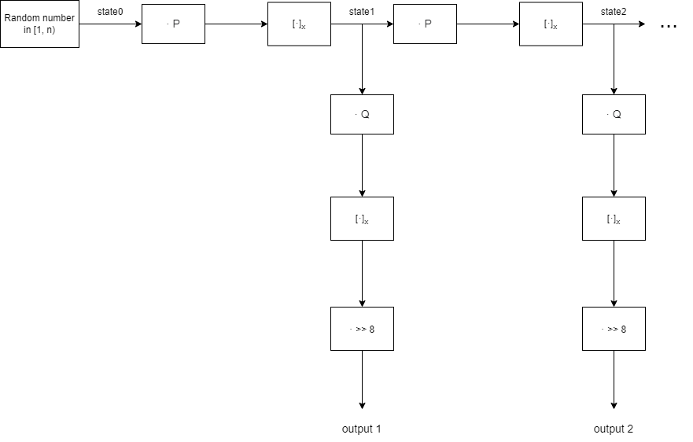
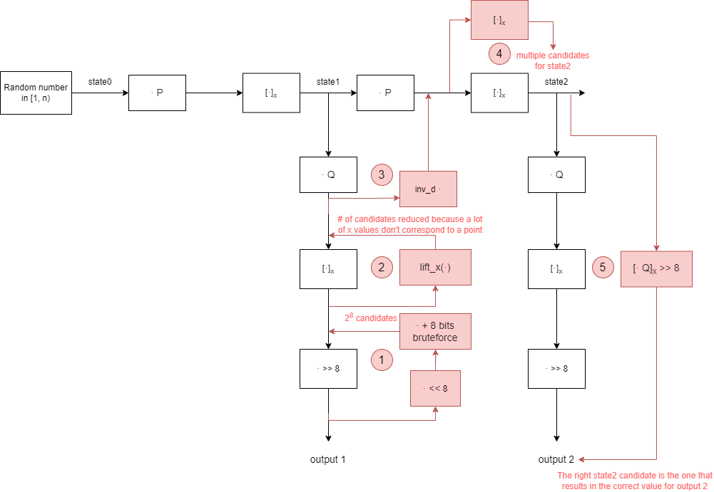
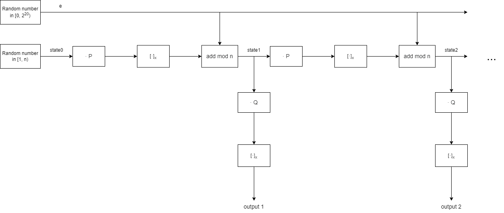
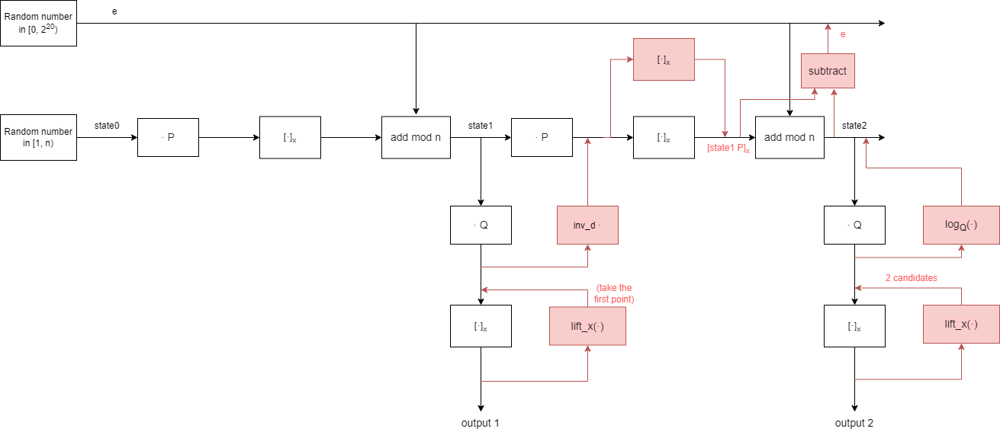

# Dual_EC_DRBG lab

## 1

Let **[&middot;]x** be a function returning the x-coordinate of a point on a (Weierstrass) elliptic curve **E**. 
Let **lift_x(.)** be a function taking as argument an x-coordinate of a point and returning all the possible points with this x-coordinate. 
Let **Px** be an x-coordinate ant let **S = lift_x(Px)** be the set of points having **Px** as x-coordinate.

We show the following statement :

#### For any constant l &in; &Zopf;*, if 0 &notin; S, then for all Q &in; S, [lQ]x is the same.

**S** can contain 0, 1 or 2 points. If **|S| = 0** or **|S| = 1**, the statement is trivially true.

For the case **|S| = 2**, we prove the statement by induction :

### Base step : case l = 1

We want to show that :

#### For **Q1 &in; S, Q2 &in; S**: **[1Q1]x = [1Q2]x**

By definition of **S**, we have **[Q1]x = [Q2]x**

Now, **Q1 = 1Q1** and **Q2 = 1Q2**

Thus, we have **[1Q1]x = [1Q2]x**

### Induction step

We want to show that :

#### For **Q1 &in; S, Q2 &in; S** : if **[iQ1]x = [iQ2]x** is true for all **i &in; [1, l]**, then **[(l+1) Q1]x = [(l+1) Q2]x** is also true

To prove this, we are going to use

- The point addition formula
- The fact that for all **R1, R2 &in; E** with **R1 &ne; R2**: **[R1]x = [R2]x => [R1]y = -[R2]y**
  - This is true because if **R1 = (x, y1)** satisfies the elliptic curve formula (i.e. **y12 = x3 + ax + b**), then the only other **y** such that **y2 = x3 + ax + b** is **-y1**.

We have :

**[(l+1) Q1]x = [l Q1 + Q1]x**

(we use the point adition formula)

**= ([l Q1]y - [Q1]y)2 / ([l Q1]x - [Q1]x)2 - [l Q1]x - [Q1]x**

(we use the fact that **[Q1]x = [Q2]x** and **[lQ1]x = [lQ2]x**)

**= ([l Q1]y - [Q1]y)2 / ([l Q2]x - [Q2]x)2 - [l Q2]x - [Q2]x**

**= (-[l Q1]y + [Q1]y)2 / ([l Q2]x - [Q2]x)2 - [l Q2]x - [Q2]x**

(we use the fact that **[Q1]y = - [Q2]y** and **[l Q1]y = - [l Q2]y**)

**= ([l Q2]y - [Q2]y)2 / ([l Q2]x - [Q2]x)2 - [l Q2]x - [Q2]x**

(we use the point addition formula)

**= [l Q2 + Q2]x = [(l+1) Q2]x**

## 2
Here is a diagramof the algorithm:

- We work in the elliptic curve [P-256](https://neuromancer.sk/std/nist/P-256)
- **P** and **Q** are points on the elliptic curve
- **n** is the order of the elliptic curve

## 3

In this attack, we are going to recover **state2** from **output1** and **output2**.

To do this, we start from **output1** and we go upward in the diagram by applying the inverse of the operations. We end up with several candidate values for **state2**. We then find the right one by generating the corresponding outputs and comparing them to **output2**.

Once **state2** is known, we use it to generate the subsequent outputs.

The code for this attack is implemented in the function `clone_dual_ec_drbg` of the file `dualec_attack.py`.

Here is a diagram of the attack : 

### Step 1 : truncation bruteforce

To reverse the **>> 8** operation, we have to perform a bruteforce as we do not know what the truncated bits are. This gives 28 candidates.

### Step 2 : lift_x

To reverse the **[·]x** operation, we use **lift_x**, which can return 0, 1 or 2 points.

- If 0 points are returned, no candidates are added to the result of this step. 
- If 1 point is returned, it is added as a candidate. 
- If 2 points are returned, they are the opposite of each other. Only the first one is added as a candidate

As a lot of the x value candidates from step 1 do not correspond to a point on the curve, the number of candidates is reduced.

We end up with several candidates, one of which is the correct value for **state1 * Q** or the opposite of **state1 * Q**.

### Step 3 : from **state1 * Q** to **state1 * P**

Let **inv_d** be the inverse of **d** modulo **n**.

Now, as **n** is the order of the elliptic curve, for all **m &in; &Nopf;** we have **m P** = **(m mod n) P**.

Thus, we have **inv_d * state1 * Q = state1 * inv_d * d *  P = state1 * P**

By the statement that we have proven in part 1, we know that if we multiply the opposite of **state1 * Q** by **inv_d** we get the opposite of **state1 * P**

Therefore, we multiply each candidate from step 2 by **inv_d** and as a result we get several candidates, one of which is the correct value for **state1 * P** or the opposite of **state1 * P**.

### Step 4 : find state1 candidates

We apply **[·]x** to each candidate from step 3. We know that one of the resulting values is the correct value for **state1**.

### Step 5 : find the right state1

For each **state1** candidate, we apply the operation **[· Q]x >> 8**. This gives us the output of the PRNG if the candidate was the state. Among the candidates, the right **state1** is the one that corresponds to **output2**.

### Clone the PRNG

Now that we know **state2**, we create an instance of the PRNG and set its state to **state2**. This means our PRNG is in the same state as the original PRNG was after having outputted **output2**.

The outputs generated by calling the `next` method of our new PRNG are equal to **output3**, **output4**, ... of the original PRNG.

The next output is **435530946971215723598722270635738118139152300846436981204670066175313191163**

## 4

We write the function `discrete_logarithm` in the file `dualec_attack.py`. This function is based on the [baby step giant step algorithm](https://en.wikipedia.org/wiki/Baby-step_giant-step).

It searches for the discrete logarithm of several points on a given interval.

## 5

Here is a diagram for the second algorithm :

In this algorithm, the state of the PRNG is given by the pair **(state, e)**.

We are going to recover the values of **state** and **e** from **output1** and **output2**. Like for the previous attack, this will allow us to predict the subsequent outputs.

The code for this attack is implemented in the function `clone_dual_ec2_drbg` of the file `dualec_attack.py`.

Here is a diagram of the attack :

### Recover [state1 P]x

We recover **[state1 P]x** in a way similar to the previous attack, except this algorithm doesn't include a truncation and thus no bruteforce is necessary.

We get **[state1 P]x** by computing **[inv_d * lift_x(output1)]x**. For the same reason as in the previous attack, it is fine to take only the first point returned by **lift_x**.

### Recover state2

#### Step 1 : state2 * Q candidates

We compute **lift_x(output2)**. This gives us two points, one of which is **state2 * Q**.

#### Step 2 : state2

We want to compute **state2 = logQ(state2 * Q)**

Now, from the PRNG algorithm we have :

**[state1 P]x + e &Congruent; state2 (mod n)** and **0 &leq; e < 220**

This allows us to put bounds on the value of (a value congruent to) **state2** :

**[state1 P]x &leq; state2 < [state1 P]x + 220**

Using the function described in point 4, we search for the logarithm in base **Q** of both candidates from step 1, in the interval **[ [state1 P]x, [state1 P]x + 220 )**.

Most likely, among the two candidates from step 1, only the logarithm of the correct candidate is in the interval **[ [state1 P]x, [state1 P]x + 220 )**, and thus the resulting value is (congruent to) **state2**.

### Recover e

From the PRNG algorithm, we have :

**[state1 P]x + e &Congruent; state2 (mod n)**

**=> e &Congruent; state2 - [state1 P]x (mod n)**

As **state2** and **[state1 P]x** are known, we can recover **e**.

### Clone the PRNG

Like for the first attack, we create an instance of the second PRNG and set its `state` attribute to **state2** and its `e` attribute to **e**. This means our PRNG is in the same state as the original PRNG was after having outputted **output2**.

The outputs generated by calling the `next` method of our new PRNG are equal to **output3**, **output4**, ... of the original PRNG.

The next output is **69020177956680728725798847564727439838967652593136356168758308595363164896522**